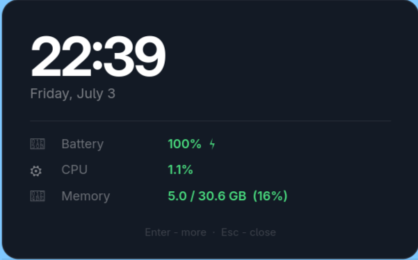

# statuspop



A minimal on-demand system status popup for GNU/Linux. Press a key binding in
your window manager and a small floating window appears with your core stats.
Press **Enter** to reveal more detail. Press **Esc** or click anywhere to close.

It was built for people who don't want a persistent status bar taking up screen
real estate. No bar is ever visible, statuspop exists only when you call it.

---

## Supported platforms

**Operating system:** GNU/Linux (x86\_64). The code reads Linux-specific
virtual filesystems (`/proc`, `/sys`, `/dev`) and uses Linux socket ioctls.
It will not run on macOS or BSD without changes.

**Window managers:** Any WM that lets you bind a key to run a shell command.
The workspace row has native support for **i3** and **sway** (via their Unix
socket IPC protocol). On any other WM it shows the `$XDG_CURRENT_DESKTOP`
environment variable instead and leaves the workspace field blank.

---

## Building

### Requirements

```bash
# Debian / Ubuntu
sudo apt install libgtk-4-dev build-essential

# Arch Linux
sudo pacman -S gtk4 base-devel

# Fedora
sudo dnf install gtk4-devel gcc make

# openSUSE
sudo zypper install gtk4-devel gcc make

# Void Linux
sudo xbps-install gtk4-devel gcc make
```

### Compile

```bash
git clone <this-repo>
make
```

```bash
make install #This installs it at ~/.local/bin/
```

---

## Tuning

Constants at the top of `src/main.c`:

```c
#define REFRESH_MS        1000   // compact panel refresh interval (ms)
#define EXPAND_REFRESH_MS 2000   // expanded panel refresh interval (ms)
#define WINDOW_WIDTH      400    // popup width in pixels               
#define REVEAL_MS         180    // expand/collapse slide animation (ms)
```

---

## License

GNU General Public License Version 3.
